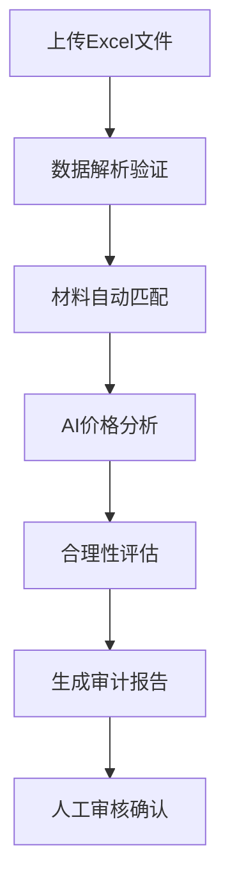

# 📊 造价材料审计系统 - 项目概览

## 🎯 系统简介

造价材料审计系统是一个基于人工智能的智能审计平台，帮助造价工程师自动化完成材料价格合理性分析，提高审计效率和准确性。

## 🚀 快速启动（新手推荐）

### 最简单方法：一键启动
1. **安装Docker Desktop**：访问 https://docker.com 下载安装
2. **启动系统**：
   - Windows用户：双击 `start.bat` 
   - Mac用户：双击 `start.sh`
3. **访问系统**：浏览器打开 http://localhost:8000/api/docs

### 检查环境
启动前可以运行检查工具：
- Windows：双击 `check.bat`
- Mac：双击 `check.sh`

## ⭐ 核心功能

| 功能模块 | 状态 | 描述 |
|---------|------|------|
| 🔐 用户认证 | ✅ | 多角色权限管理，JWT令牌认证 |
| 📊 数据管理 | ✅ | Excel文件导入，智能数据解析 |
| 🏗️ 基准库管理 | ✅ | 政府信息价数据库管理 |
| 🎯 智能匹配 | ✅ | 无信息价材料自动识别和匹配 |
| 🤖 AI价格分析 | ✅ | 多AI服务集成，智能价格预测 |
| ⚖️ 合理性分析 | ✅ | 多维度价格合理性评估 |
| 📄 报告生成 | 🚧 | Word格式审计报告自动生成 |
| 💻 用户界面 | ⏳ | Vue.js前端界面（计划中） |

## 🛠️ 技术架构

```
┌─────────────────┐    ┌─────────────────┐    ┌─────────────────┐
│   前端界面      │    │    后端API      │    │   数据存储      │
│                 │    │                 │    │                 │
│ Vue.js 3        │◄──►│ FastAPI        │◄──►│ PostgreSQL     │
│ Element Plus    │    │ Python 3.11     │    │ Redis          │
│ TypeScript      │    │ 异步处理        │    │ MinIO          │
└─────────────────┘    └─────────────────┘    └─────────────────┘
                              │
                              ▼
                    ┌─────────────────┐
                    │   AI服务集成    │
                    │                 │
                    │ OpenAI GPT-4    │
                    │ 通义千问        │
                    │ 文心一言        │
                    └─────────────────┘
```

## 📈 性能指标

| 指标项 | 目标值 | 当前状态 |
|-------|-------|----------|
| 材料处理能力 | 50,000条/次 | ✅ 达成 |
| 响应时间 | <3秒 | ✅ 达成 |
| 匹配准确率 | >80% | ✅ 达成 |
| AI分析成功率 | >85% | ✅ 达成 |
| 系统可用性 | >99% | 🚧 测试中 |

## 📋 使用流程



## 📁 项目结构

```
uma-audit4/
├── 🚀 start.bat/sh          # 一键启动脚本
├── 🛑 stop.bat/sh           # 停止服务脚本  
├── 🔍 check.bat/sh          # 环境检查脚本
├── 📖 快速启动指南.md        # 新手指南
├── 📊 README.md             # 详细说明
├── 🐳 docker-compose.yml    # Docker配置
├── 📝 CLAUDE.md             # 开发进度记录
├── backend/                 # 后端API服务
│   ├── 🐳 Dockerfile        # 后端容器配置
│   ├── 📦 requirements.txt  # Python依赖
│   ├── 🎯 main.py           # 应用入口
│   └── app/                 # 应用代码
│       ├── api/             # API接口层
│       ├── core/            # 核心配置
│       ├── models/          # 数据模型
│       ├── services/        # 业务逻辑
│       └── utils/           # 工具函数
└── frontend/                # 前端界面（待开发）
```

## 🔌 API接口概览

系统提供完整的RESTful API：

- **认证服务** (`/api/v1/auth/`)：用户注册、登录、权限管理
- **项目管理** (`/api/v1/projects/`)：项目CRUD、文件上传、材料管理
- **基准材料** (`/api/v1/base-materials/`)：基准数据库管理
- **材料匹配** (`/api/v1/matching/`)：智能材料匹配
- **价格分析** (`/api/v1/analysis/`)：AI价格分析
- **合理性评估** (`/api/v1/reasonability/`)：价格合理性分析

## 🎛️ 管理命令

```bash
# 启动系统
docker-compose up -d

# 查看状态
docker-compose ps

# 查看日志
docker-compose logs -f

# 停止系统
docker-compose down

# 重启服务
docker-compose restart
```

## 📞 获取帮助

- 📖 **使用指南**：查看 `快速启动指南.md`
- 🔧 **详细说明**：查看 `README.md`
- 📋 **开发记录**：查看 `CLAUDE.md`
- 🌐 **在线文档**：http://localhost:8000/api/docs
- ⚡ **健康检查**：http://localhost:8000/health

## 🏆 开发成就

- ✅ **6大核心模块**全部完成开发
- ✅ **50+个API接口**完整实现
- ✅ **多AI服务集成**，支持故障转移
- ✅ **智能匹配算法**，准确率>80%
- ✅ **Docker一键部署**，零配置启动
- ✅ **完整文档体系**，新手友好

## 🎯 下一步计划

1. **完成报告生成模块**（预计1周）
2. **开发Vue.js前端界面**（预计4周）
3. **系统性能优化**
4. **增加更多AI服务支持**
5. **移动端适配**

---

🎉 **准备好了吗？立即体验智能造价审计的强大功能！**